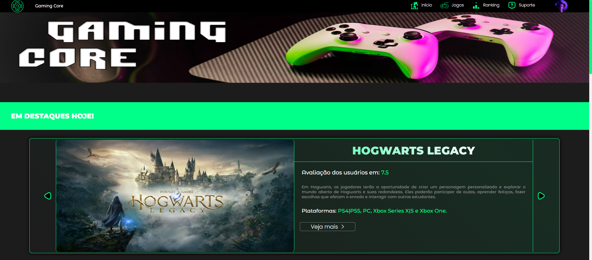

<h1 align="center"> Gaming Core </h1>

Site completo de avaliação de games, feito especialmente para os gamers de plantão. 

 

  

## 🚀 Tecnologias

Esse projeto foi desenvolvido com as seguintes tecnologias:

- HTML e CSS
- JavaScript
- PHP
- MySQL
- Git e Github
- Adobe Photoshop

## 💻 Projeto

Este site foi desenvolvido por alunos da ETEC Prof Luiz Pires Barbosa, como projeto do Trabalho de Conclusão de Curso do curso de informática para internet. É uma aplicação completa com front-end e back-end, o trabalho mais importante que já fiz até agora. 

## Créditos

Feito por Dário Klein e Gabriel Ferreira Faria
